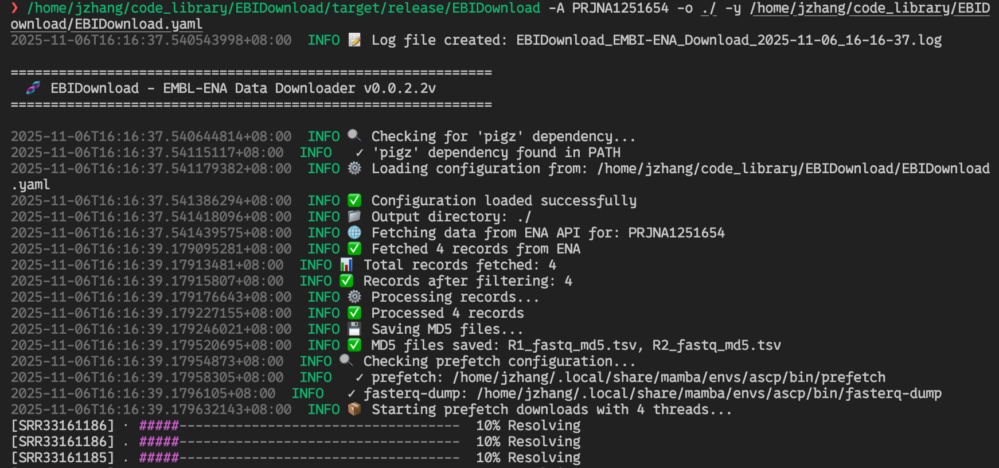

[中文文档](./docs/README_zh.md) | English

# EBIDownload

EBIDownload is a command-line tool developed in Rust for efficiently downloading sequencing data from the European Bioinformatics Institute (EBI) FTP server. This tool utilizes the [IBM Aspera CLI](https://www.ibm.com/aspera/connect/) for high-speed downloads and [pigz](https://zlib.net/pigz/) for parallel decompression, significantly improving data acquisition efficiency.



## Features

- **High-Speed Download**: Integrates Aspera CLI to overcome traditional FTP/HTTP speed limits.
- **Parallel Processing**: Supports multi-threaded downloading and decompression.
- **Easy Configuration**: Manages Aspera paths and keys through a simple YAML file.
- **Flexible Usage**: Supports direct downloads via project accession numbers.

---

## 1. Prerequisites and Setup

Before running this program, please ensure you have completed the following environment setup.

### a. Conda Environment

This project depends on a specific version of `aspera-cli`. We recommend using Conda to create an isolated runtime environment.

```bash
# Create and activate the conda environment using the provided .yaml file
conda env create -f EBIDownload_env.yaml
conda activate EBIDownload_env
```

### b. Install pigz

`pigz` is a parallel implementation of `gzip` that can significantly speed up file decompression.

- **For Ubuntu/Debian systems:**
  ```bash
  sudo apt-get update
  sudo apt-get install pigz
  ```

- **For macOS systems (using Homebrew):**
  ```bash
  brew install pigz
  ```

---

## 2. Building the Program

This project is written in Rust. You need to install the [Rust environment](https://www.rust-lang.org/tools/install) first.

```bash
# Clone the repository
# git clone git@github.com:xsx123123/EBIDownload.git
# cd EBIDownload

# Build for development (faster, for debugging)
cargo build

# Build for release (optimized for performance, for production)
cargo build --release
```

The compiled executable will be located at `target/release/EBIDownload`.

---

## 3. Configuration File

This program uses a YAML file (defaulting to `EBIDownload.yaml`) to configure the paths for required software and the Aspera key.

You need to **manually create** this file and fill in the correct absolute paths according to your system environment.

Below is the standard format for the `EBIDownload.yaml` file:

```yaml
# EBIDownload Setting yaml
software:
  ascp: /path/to/your/ascp
  prefetch: /path/to/your/prefetch
  fasterq_dump: /path/to/your/fasterq-dump
setting:
  openssh: /path/to/your/asperaweb_id_dsa.openssh
```

**Important Notes**:
- The `software` section must point to the absolute paths of the `ascp`, `prefetch`, and `fasterq-dump` executables.
- The `openssh` key in the `setting` section must point to the absolute path of the key file provided by Aspera Connect (`asperaweb_id_dsa.openssh`).
- Ensure all paths are correct, or the program will not run properly.

---

## 4. Usage

### a. Command-Line Arguments

According to the program's help information, the correct usage is as follows:

```
Download EMBL-ENA sequencing data

Usage: EBIDownload [OPTIONS] --output <OUTPUT>
```

| Short | Long             | Description                                      | Default      |
|-------|------------------|--------------------------------------------------|--------------|
| `-A`  | `--accession`    | Download by project Accession ID                 |              |
| `-T`  | `--tsv`          | Download using a TSV file containing Accession IDs |              |
| `-o`  | `--output`       | **Required**, the output directory for downloaded files |              |
| `-p`  | `--multithreads` | Number of threads for downloading and processing | 4            |
| `-d`  | `--download`     | Download method (`ascp`, `ftp`, `prefetch`)      | `prefetch`   |
| `-O`  | `--only-scripts` | Only generate download scripts, do not execute   |              |
| `-y`  | `--yaml`         | Specify the path to the `EBIDownload.yaml` config file | `EBIDownload.yaml` |
|       | `--filter-sample`| Only download samples matching this ID           |              |
|       | `--filter-run`   | Only download runs matching this ID              |              |
|       | `--exclude-sample`| Exclude samples matching this ID                 |              |
|       | `--exclude-run`  | Exclude runs matching this ID                    |              |
| `-h`  | `--help`         | Print help information                           |              |
| `-V`  | `--version`      | Print version information                        |              |

**Note**: The `-A` and `-T` options are typically mutually exclusive and are used to specify the data source to download.

### b. Example

The following example demonstrates how to download data for project `PRJNA1251654`, using 6 threads, and saving the files to the current directory.

```bash
# Make sure you have activated the conda environment and the config file is set up correctly
# conda activate EBIDownload_env

# Example command:
./target/release/EBIDownload -A PRJNA1251654 -o ./ --multithreads 6 --yaml ./EBIDownload.yaml
```

This command will:
1. Read the configuration from `./EBIDownload.yaml`.
2. Query all sample data under the project `PRJNA1251654`.
3. Use the `prefetch` method (default) to download the data at high speed with up to 6 threads into the current directory (`./`).
4. After the download is complete, automatically perform subsequent processing (like decompression).