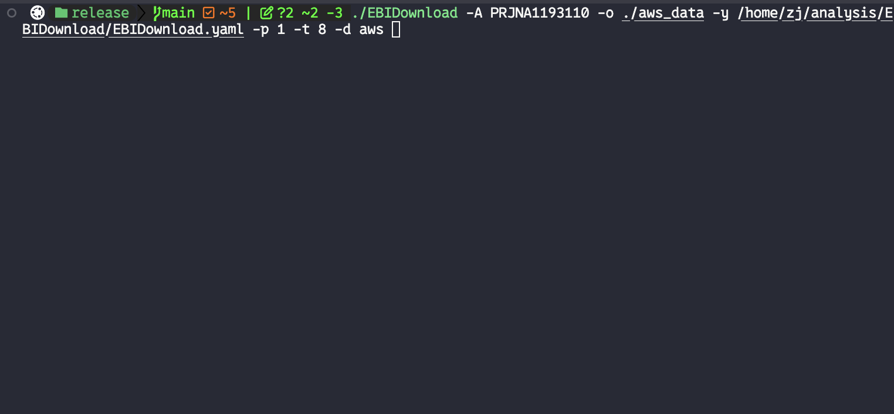

[中文文档](./docs/README_zh.md) | English

# EBIDownload

EBIDownload is a command-line tool developed in Rust for efficiently downloading sequencing data from the European Bioinformatics Institute (EBI) FTP server and NCBI SRA. This tool utilizes **AWS S3 global acceleration** and the [IBM Aspera CLI](https://www.ibm.com/aspera/connect/) to achieve ultra-fast download speeds (comparable to IDM/Aspera). **It is capable of downloading 2TB of data from the SRA database to local storage within 24 hours**, while providing full support for **resumable downloads** and **MD5 integrity verification**. It also employs [pigz](https://zlib.net/pigz/) for parallel decompression, significantly improving data acquisition efficiency.



## Features

- **AWS S3 Acceleration (Most Recommended)**: Direct multi-threaded downloading from NCBI SRA AWS S3 buckets, maximizing bandwidth utilization for global high-speed access. This is the fastest and most reliable method for large-scale data acquisition.
- **High-Speed Download**: Integrates Aspera CLI to overcome traditional FTP/HTTP speed limits.
- **Parallel Processing**: Supports multi-threaded downloading and decompression.
- **Easy Configuration**: Manages software paths and keys through a simple YAML file.
- **Flexible Usage**: Supports direct downloads via project accession numbers.
- **Resumable Downloads**: Supports resumable downloads in `aws`, `ascp` and `prefetch` modes, ensuring download continuity.
- **Smart Auto-Fallback**: Automatically attempts AWS S3 first and seamlessly switches to Prefetch if the AWS download fails (Mode: `auto`).
- **Advanced Filtering**: Supports Regex-based filtering to precisely include or exclude specific samples or runs.

---

## 1. Prerequisites and Setup

Before running this program, please ensure you have completed the following environment setup.

### a. Conda Environment

This project depends on `sra-tools` (providing `prefetch` and `fasterq-dump`) and `aspera-cli`. We recommend using Conda to create an isolated runtime environment.

```bash
# Create and activate the conda environment using the provided .yaml file
conda env create -f ./docs/EBIDownload_env.yaml
conda activate EBIDownload_env
```

### b. Install pigz

`pigz` is a parallel implementation of `gzip` that can significantly speed up file decompression.

- **For Ubuntu/Debian systems:**
  ```bash
  sudo apt-get update
  sudo apt-get install pigz
  ```

- **For macOS systems (using Homebrew):**
  ```bash
  brew install pigz
  ```

---

## 2. Building the Program

This project is written in Rust. You need to install the [Rust environment](https://www.rust-lang.org/tools/install) first.

```bash
# Clone the repository
# git clone git@github.com:xsx123123/EBIDownload.git
# cd EBIDownload

# Build for development (faster, for debugging)
CC=clang cargo build

# Build for release (optimized for performance, for production)
CC=clang cargo build --release
```

The compiled executable will be located at `target/release/EBIDownload`.

---

## 3. Configuration File

This program uses a YAML file (defaulting to `EBIDownload.yaml`) to configure the paths for required software and the Aspera key.

You need to **manually create** this file and fill in the correct absolute paths according to your system environment.

Below is the standard format for the `EBIDownload.yaml` file:

```yaml
# EBIDownload Setting yaml
software:
  ascp: /path/to/your/ascp
  prefetch: /path/to/your/prefetch
  fasterq_dump: /path/to/your/fasterq-dump
setting:
  openssh: /path/to/your/asperaweb_id_dsa.openssh
```

**Important Notes**:
- The `software` section must point to the absolute paths of the `ascp`, `prefetch`, and `fasterq-dump` executables.
- The `openssh` key in the `setting` section must point to the absolute path of the key file provided by Aspera Connect (`asperaweb_id_dsa.openssh`).
- Ensure all paths are correct, or the program will not run properly.

---

## 4. Usage

### a. Command-Line Arguments

According to the program's help information, the correct usage is as follows:

```
Download EMBL-ENA sequencing data

Usage: EBIDownload [OPTIONS] --output <OUTPUT>
```

| Short | Long             | Description                                      | Default      |
|-------|------------------|--------------------------------------------------|--------------|
| `-A`  | `--accession`    | Download by project Accession ID                 |              |
| `-T`  | `--tsv`          | Download using a TSV file containing Accession IDs |              |
| `-o`  | `--output`       | **Required**, the output directory for downloaded files |              |
| `-p`  | `--multithreads` | Number of files to download in parallel          | 4            |
| `-d`  | `--download`     | Download method (`aws`, `ascp`, `ftp`, `prefetch`, `auto`) | `aws`        |
| `-O`  | `--only-scripts` | Only generate download scripts, do not execute   | `false`      |
| `-y`  | `--yaml`         | Specify the path to the `EBIDownload.yaml` config file | `EBIDownload.yaml` |
|       | `--log-level`    | Log level (`debug`, `info`, `warn`, `error`)     | `info`       |
|       | `--log-format`   | Log output format (`text`, `json`)               | `text`       |
| `-t`  | `--aws-threads`  | **AWS/Prefetch**: Threads for internal chunk download or conversion per file | 8            |
|       | `--chunk-size`   | **AWS Only**: Chunk size in MB                   | 20           |
|       | `--max-size`     | **Prefetch Only**: Max download size limit (e.g., `100G`) | `100G`       |
|       | `--pe-only`      | Only download Paired-End data, ignore Single-End | `false`      |
|       | `--filter-sample`| Regex pattern to include samples matching this   |              |
|       | `--filter-run`   | Regex pattern to include runs matching this      |              |
|       | `--exclude-sample`| Regex pattern to exclude samples matching this   |              |
|       | `--exclude-run`  | Regex pattern to exclude runs matching this      |              |
| `-h`  | `--help`         | Print help information                           |              |
| `-V`  | `--version`      | Print version information                        |              |

**Note**: The `-A` and `-T` options are typically mutually exclusive and are used to specify the data source to download.

### b. Example

**1. AWS S3 High-Speed Mode (Most Recommended)**

This mode uses AWS S3 buckets for global acceleration, similar to IDM. It is the best choice for large-scale data acquisition.

```bash
# Download using AWS S3 with 8 threads per file, processing 4 files in parallel
./target/release/EBIDownload -A PRJNA1251654 -o ./data -d aws -p 4 -t 8
```

**2. Standard Mode (Prefetch)**

The following example demonstrates how to download data for project `PRJNA1251654`, using 6 threads, and saving the files to the current directory.

```bash
# Make sure you have activated the conda environment and the config file is set up correctly
# conda activate EBIDownload_env

# Example command:
./target/release/EBIDownload -A PRJNA1251654 -o ./ --multithreads 6 --yaml ./EBIDownload.yaml -d prefetch
```

**3. Alternative: Python Script (AWS Only)**

If you prefer using Python, we also provide a script based on `boto3` for high-speed AWS S3 downloads. You can find it in the `python/` directory.

```bash
# Usage example for the Python alternative
python python/sra_downloader_aws_v2.py -A PRJNA1251654 -o ./data
```

**Note on Data Integrity**: To ensure the integrity of downloaded data, it is recommended to perform MD5 verification after the download is complete.

---
## 5. Output Structure

After the script runs, the output directory will contain the following files and directories:

```
.
├── EBIDownload_EMBI-ENA_Download_YYYY-MM-DD_HH-MM-SS.log
├── R1_fastq_md5.tsv
├── R2_fastq_md5.tsv
├── SRRXXXXXX/
│   └── ... (downloaded files)
└── ...
```

- **Log File**: `EBIDownload_EMBI-ENA_Download_... .log`
  - Records the detailed execution log of the script.

- **MD5 Checksum Files**: `R1_fastq_md5.tsv` and `R2_fastq_md5.tsv`
  - These files contain the official MD5 checksums and sample names retrieved from the EBI database for the downloaded FASTQ files (R1 and R2 reads, respectively). You can use these files to verify the integrity of your downloaded data.

- **Sample Directories**: `SRRXXXXXX/`
  - Each directory corresponds to a downloaded sample (Run ID) and contains the actual sequencing data files.
