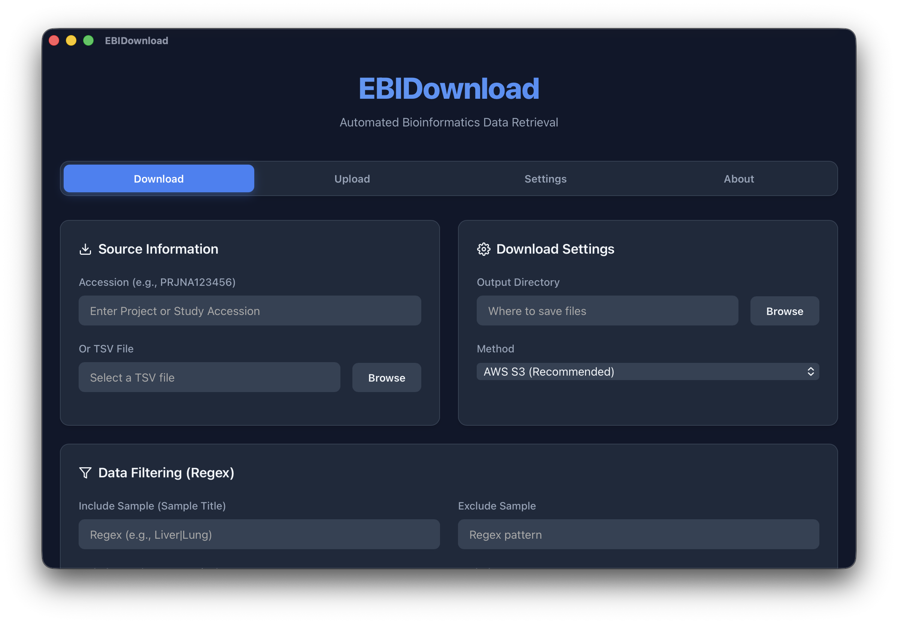

[English](../README.md) | 中文文档

# EBIDownload

EBIDownload 是一个基于 Rust 开发的命令行工具，用于高效地从欧洲生物信息学研究所 (EBI) FTP 服务器和 NCBI SRA 数据库下载测序数据。本工具默认采用 **AWS S3 全球加速**进行多线程下载，可实现媲美 IDM/Aspera 的极速下载。**它支持 24 小时从 SRA 数据库下载 2TB 数据到本地，并提供完善的断点续传与 MD5 完整性校验**。`.fastq` 到 `.fastq.gz` 的压缩采用 Rust 原生并行 gzip（[`gzp`](https://crates.io/crates/gzp) + `libdeflate` 后端），无需额外安装外部压缩工具。

此外，EBIDownload 还支持 **Aspera CLI (`ascp`)** 作为备选高速下载方式，可通过 `-d ascp` 参数手动切换。如需使用该备选通道，请在 `EBIDownload.yaml` 中提前配置好 Aspera 的路径与密钥（详见 [配置文件](#3-配置文件)）。



*EBIDownload 桌面端 GUI：包含 Download、Upload、Settings 和 About 标签页。*

## 主要特性

- **AWS S3 全球加速 (强烈推荐)**: 直接从 NCBI SRA 的 AWS S3 存储桶进行多线程下载，充分利用带宽，实现全球范围的高速访问。这是目前获取大规模数据最快、最稳定的方式。
- **Aspera 备选通道**: 集成 Aspera CLI (`ascp`)，当 AWS S3 不可用或用户需要时，可作为备选高速下载方式。
- **并行处理**: 支持文件级与分片级的多线程下载、转换及原生并行 gzip 压缩。
- **易于配置**: 通过简单的 YAML 文件管理软件路径和 Aspera 密钥。
- **灵活使用**: 支持通过项目登录号 (Accession) 或 TSV 文件直接下载。
- **断点续传**: 在 `aws`, `ascp` 和 `prefetch` 下载模式下均支持断点续传，保障大文件下载的连续性。
- **智能自动回退**: 支持 `auto` 模式，优先尝试 AWS S3 下载，若失败则自动无缝切换至 Prefetch 模式。
- **高级过滤**: 支持基于正则表达式 (Regex) 的过滤功能，可精确包含或排除特定的样本或 Run。


---

## 1. 安装与环境准备

**为什么需要外部依赖？**
由于本项目从 NCBI/EBI 下载的原始数据主要为 `.sra` 文件，需要将其转换为标准的 `.fastq` 格式。目前 Rust 生态中尚未有成熟的原生库来解析 `.sra` 格式，因此本工具必须依赖外部 `sra-tools` 工具包完成该转换步骤。而后续的 `.fastq` → `.fastq.gz` 压缩由 Rust 原生并行 gzip 在内部完成，无需额外安装外部压缩工具。

只需要一个外部依赖，其余为可选：

- **`sra-tools` (`prefetch` / `fasterq-dump`)**: 核心依赖。`prefetch` 用于通过标准通道下载 SRA 数据；`fasterq-dump` 用于将 `.sra` 文件拆分并转换为 `.fastq` 测序文件。EBIDownload 可以**自动下载并安装**该依赖（见 [依赖管理](#2-编译程序)），你也可以手动安装。
- **`aspera-cli` (`ascp`)**: 可选依赖。IBM 开发的高速数据传输客户端，配置后可作为常规 FTP 的替代方案实现极速下载。如需使用 `ascp` 模式，请手动安装并在 `EBIDownload.yaml` 中配置路径。

### a. Conda 环境（可选手动安装）

如果你偏好 Conda，可以创建隔离运行环境来安装 `sra-tools` 和 `aspera-cli`。

```bash
# 使用项目提供的 .yaml 文件创建并激活 conda 环境
conda env create -f ./docs/EBIDownload_env.yaml
conda activate EBIDownload_env
```

---

## 2. 编译程序

本项目使用 Rust 编写，你需要先安装 [Rust 环境](https://www.rust-lang.org/tools/install)。

```bash
# 克隆仓库
# git clone git@github.com:xsx123123/EBIDownload.git
# cd EBIDownload

# 编译开发版 (较快, 用于调试)
CC=clang cargo build -p ebidownload-cli

# 编译发行版 (优化性能, 用于生产)
CC=clang cargo build -p ebidownload-cli --release
```

编译后的可执行文件位于 `target/release/EBIDownload`。

`sra-tools` 在编译时不是必需的。首次运行前可以通过以下命令自动安装：

```bash
./target/release/EBIDownload deps install
```

也可以随时检查、列出或移除已安装的依赖：

```bash
./target/release/EBIDownload deps check
./target/release/EBIDownload deps list
./target/release/EBIDownload deps remove
```

---

## 3. 配置文件

本程序通过一个 YAML 文件 (默认为 `EBIDownload.yaml`) 来配置外部工具的路径，包括 Aspera CLI (`ascp`) 和 `sra-tools` (`prefetch`、`fasterq-dump`)。

`sra-tools` 的路径是可选的：如果 YAML 中没有配置，EBIDownload 会依次回退到托管安装目录（由 `EBIDownload deps install` 或 GUI 的启动安装对话框创建）和系统 `PATH` 中的可执行文件。

你可以**手动创建**此文件来使用自己的安装。即使你主要使用默认的 **AWS S3** 模式，也建议提前配置好 Aspera 的路径与密钥，以便在需要切换至 `ascp` 模式时随时可用。

以下是 `EBIDownload.yaml` 文件的标准格式:

```yaml
# EBIDownload Setting yaml
software:
  ascp: /path/to/your/ascp
  prefetch: /path/to/your/prefetch
  fasterq_dump: /path/to/your/fasterq-dump
setting:
  openssh: /path/to/your/asperaweb_id_dsa.openssh
```

**重要提示**:
- `software` 部分需要指向 `ascp`, `prefetch`, 和 `fasterq-dump` 这三个可执行文件的绝对路径。
- `setting` 部分是可选的。如果存在，`openssh` 需要指向 Aspera Connect 提供的密钥文件 (`asperaweb_id_dsa.openssh`) 的绝对路径；使用 Aspera (`ascp`) 下载模式时该配置为必需项。
- 请确保对应下载模式所需的路径都是准确的，否则程序在相应模式下将无法正常运行。

---

## 4. 使用方法

### a. 命令行参数

根据程序的帮助信息，正确的使用方式如下：

```
./EBIDownload download -h

    ███████╗██████╗ ██╗██████╗  ██████╗ ██╗      ██████╗  █████╗ ██████╗
    ██╔════╝██╔══██╗██║██╔══██╗██╔═══██╗██║     ██╔═══██╗██╔══██╗██╔══██╗
    █████╗  ██████╔╝██║██║  ██║██║   ██║██║     ██║   ██║███████║██║  ██║
    ██╔══╝  ██╔══██╗██║██║  ██║██║   ██║██║     ██║   ██║██╔══██║██║  ██║
    ███████╗██████╔╝██║██████╔╝╚██████╔╝███████╗╚██████╔╝██║  ██║██████╔╝
    ╚══════╝╚═════╝ ╚═╝╚═════╝  ╚═════╝ ╚══════╝ ╚═════╝ ╚═╝  ╚═╝╚═════╝

              🧬  EMBL-ENA Data Toolkit   |  v1.4.0


Download and upload sequencing data (EBI ENA / NCBI SRA)

Usage: EBIDownload [OPTIONS] <COMMAND>
```

**全局参数**：

| 短参数 | 长参数 | 描述 | 默认值 |
|--------|--------|------|--------|
| `-y` | `--yaml` | 指定 `EBIDownload.yaml` 配置文件路径 | `EBIDownload.yaml` |
| | `--log-level` | 日志级别 (`trace`, `debug`, `info`, `warn`, `error`) | `info` |
| | `--log-format` | 日志输出格式 (`text`, `json`) | `text` |
| `-h` | `--help` | 打印帮助信息 | |
| `-V` | `--version` | 打印版本信息 | |

**下载子命令参数** (`EBIDownload download`)：

| 短参数 | 长参数             | 描述                                     | 默认值      |
|--------|--------------------|------------------------------------------|-------------|
| `-A`   | `--accession`      | 按项目登录号 (Accession ID) 下载          |             |
| `-T`   | `--tsv`            | 按包含登录号的 TSV 文件下载              |             |
| `-o`   | `--output`         | **必需**, 下载文件的输出目录             |             |
| `-p`   | `--multithreads`   | 并行下载的文件数量                       | 4           |
| `-d`   | `--download`       | 下载方式 (`aws`, `ascp`, `ftp`, `prefetch`, `auto`) | `aws`       |
| `-t`   | `--aws-threads`    | **AWS/Prefetch**: 单文件内部分片下载或转换线程数 | 8           |
|        | `--chunk-size`     | **AWS 专用**: 分片大小 (MB)              | 20          |
|        | `--max-size`       | **Prefetch 专用**: 最大下载大小限制 (例如 `100G`) | `100G`      |
|        | `--pe-only`        | 仅下载双端测序(Paired-End)数据，忽略单端数据 | `false`     |
|        | `--filter-sample`  | 正则表达式: 仅下载匹配该模式的样本 (sample) |             |
|        | `--filter-run`     | 正则表达式: 仅下载匹配该模式的运行 (run)    |             |
|        | `--exclude-sample` | 正则表达式: 排除匹配该模式的样本 (sample)   |             |
|        | `--exclude-run`    | 正则表达式: 排除匹配该模式的运行 (run)      |             |
|        | `--cleanup-sra`    | 转换后删除中间 .sra 文件                 | `false`     |
|        | `--dry-run`        | 预览将要下载的内容，不执行实际下载       | `false`     |

**上传子命令参数** (`EBIDownload upload`)：详见 [第 6 节](#6-通过-aws-s3-上传数据至-ncbi-sra)。

**注意**: `-A` 和 `-T` 选项通常互斥，用于指定要下载的数据源。

### b. 使用示例

**1. AWS S3 高速模式 (强烈推荐)**

该模式利用 AWS S3 存储桶实现全球加速，下载速度极快，是进行大规模数据获取的首选方案。

```bash
# 使用 AWS S3 模式下载，每个文件开启 8 线程分片下载，同时下载 4 个文件
./target/release/EBIDownload download -A PRJNA1251654 -o ./data -d aws -p 4 -t 8
```

**2. 过滤模式**

你可以使用 `--filter-run` 或 `--filter-sample` 来指定下载特定的数据。

```bash
# 下载指定项目中的特定 Run (单个)
./target/release/EBIDownload download -A PRJNA833659 -o ./ -p 6 -d aws -y /data/jzhang/software/EBIDownload/EBIDownload.yaml --chunk-size 200 --filter-run SRR19019104

# 下载多个指定的 Run (空格分隔)
./target/release/EBIDownload download -A PRJNA833659 -o ./ -p 6 -d aws --filter-run SRR19019104 SRR19019105

# 下载项目中指定的一批 Run (适用于靶向重分析)
./target/release/EBIDownload download -A PRJNA259308 -o ./ -p 6 -d aws \
  -y /data/jzhang/software/EBIDownload/EBIDownload.yaml \
  --chunk-size 200 \
  --filter-run SRR1572540 SRR1572541 SRR1572542 
```

**3. 标准模式 (Prefetch)**

以下示例演示如何下载项目 `PRJNA1251654` 的数据，使用 6 线程，并将文件保存到当前目录。

```bash
# 请确保已激活 conda 环境且配置文件正确设置
# conda activate EBIDownload_env

# 示例命令:
./target/release/EBIDownload download -A PRJNA1251654 -o ./ --multithreads 6 --yaml ./EBIDownload.yaml -d prefetch
```

---

## AWS S3 高速下载模式重要说明

本工具基于 AWS S3 开放数据池（`s3://sra-pub-run-odp/`）实现高速下载，仅适用于已完成 SRA 归档的数据。由于 NCBI 数据处理流程的固有时序，存在以下重要限制：

1. **数据可用性延迟**
   GEO 元数据发布（获得 GSE/GSM 号）≠ SRA 数据可用。
   原始测序数据需经过质检、格式转换、索引建立等流程，通常需要 **1–4 周** 才会从 GEO 转入 SRA 并同步至 AWS S3。
   在此期间，即使 GEO 页面已公开，S3 路径尚未生成，工具将返回 404 错误。

2. **如何判断数据是否就绪**
   在下载前，请先确认：
   - GEO 页面已显示 "SRA Run Selector" 链接（而非 "Data coming soon"）
   - 或通过命令行验证：`esearch -db sra -query "GSEXXXXXX" | efetch -format runinfo` 能返回 SRR 编号列表

3. **未就绪数据的替代方案**
   如果数据尚未进入 SRA：
   - **使用 SRA Toolkit**：通过 `prefetch` 命令提交下载请求，系统将在数据可用后自动获取（可能需要排队等待）
   - **联系原作者**：GEO 页面提供通讯作者联系方式，通常可在 24–48 小时内获得直接下载链接（FTP、Google Drive 等）
   - **检查 ENA 镜像**：欧洲核苷酸档案（ENA）有时比 SRA 提前 1–3 天可用，可尝试 `ftp://ftp.sra.ebi.ac.uk/`

4. **推荐下载策略**
   建议实现分层下载逻辑：先检查 SRA 可用性，若已就绪则使用本工具进行高速 S3 下载；若未就绪，则自动回退至 SRA Toolkit 或提示用户等待/联系作者。

> **注**：此限制源于 NCBI 数据归档架构，非本工具技术缺陷。对于紧急需求，建议优先联系数据提交者获取原始文件。

---
## 5. 输出结构

脚本运行后，输出目录将包含以下文件和目录：

```
.
├── EBIDownload_{ACCESSION}_YYYY-MM-DD_HH-MM-SS.log
├── ena_metadata_{ACCESSION}.tsv
├── R1_fastq_md5_{ACCESSION}.tsv
├── R2_fastq_md5_{ACCESSION}.tsv
├── SRRXXXXXX/
│   └── ... (下载的数据文件)
└── ...
```

- **日志文件**: `EBIDownload_{ACCESSION}_YYYY-MM-DD_HH-MM-SS.log`
  - 记录脚本的详细执行日志，文件名中包含 Accession ID 以便识别。

- **元数据文件**: `ena_metadata_{ACCESSION}.tsv`
  - 包含从 EBI API 获取的所有元数据（含过滤后结果），文件头部注释会注明来源项目。

- **MD5 校验文件**: `R1_fastq_md5_{ACCESSION}.tsv` 和 `R2_fastq_md5_{ACCESSION}.tsv`
  - 这些文件包含从 EBI 数据库获取的官方 MD5 校验值和样本名称，分别对应下载的 FASTQ 文件的 R1 和 R2 读段。你可以使用这些文件来验证下载数据的完整性。

- **样本目录**: `SRRXXXXXX/`
  - 每个目录对应一个已下载的样本（Run ID），包含实际的测序数据文件。

---

## 6. 通过 AWS S3 上传数据至 NCBI SRA

除了下载功能外，EBIDownload 还支持**将测序数据上传至 AWS S3**，用于快速提交到 NCBI SRA。当你需要提交大量数据（数百 GB 到 TB 级别）并希望利用 AWS 的企业级带宽实现稳定、高速上传时，该功能非常有用。

### a. 前提条件

- **你自己的 AWS S3 Bucket**：必须创建一个**位于 `us-east-1`（美国东部 - 弗吉尼亚北部）区域**的 S3 bucket。这是 [NCBI 的硬性要求](https://www.ncbi.nlm.nih.gov/sra/docs/data-delivery)——其他区域的 bucket 将无法被 SRA 提交门户接受。
- **AWS 凭证**：通过 `aws configure` 或环境变量（`AWS_ACCESS_KEY_ID`、`AWS_SECRET_ACCESS_KEY`）配置 AWS 凭证。这些凭证仅在本地使用，**绝不会共享给 NCBI**。

### b. 工作原理

基于 S3 的 SRA 提交采用**只读权限模型**——你不需要给 NCBI 任何凭证：

1. **上传文件**到你的 S3 bucket（使用你自己的 AWS key，由 `EBIDownload upload` 处理）
2. **应用 Bucket Policy**，授权 NCBI 的 IAM 用户（`arn:aws:iam::228184908524:user/SA-SubmissionPortal-S3`）拥有只读权限（由 `--apply-policy` 处理）
3. **在 SRA 提交门户**（[https://submit.ncbi.nlm.nih.gov/subs/sra/](https://submit.ncbi.nlm.nih.gov/subs/sra/)）选择 "Upload from Amazon S3 storage" 并提供你的 S3 路径

```
你 (Bucket 所有者)                    NCBI SRA 提交门户
       │                                    │
       │  1. 上传文件 (使用你的 AWS key)      │
       │  ──────────────────► S3 Bucket      │
       │                                    │
       │  2. 添加 Bucket Policy              │
       │     (为 NCBI IAM 用户授予只读权限)   │
       │  ──────────────────► S3 Bucket      │
       │                                    │
       │  3. 在门户提交 S3 路径              │
       │  ──────────────────────────────────►│
       │                                    │
       │              NCBI 读取文件          │
       │              (使用他们自己的 IAM key)│
       │                                    ├────► S3 Bucket (只读)
```

### c. 费用说明

| 项目 | 费用 |
|------|------|
| S3 存储 | ~$0.023/GB/月 |
| 上传流量（进入 AWS） | **免费** |
| NCBI 读取流量（同区域） | **免费** |

实际费用**仅为存储费**。例如，100 GB 数据存储 2 周的费用不到 **$1**。一旦 SRA 确认你的提交已被处理，你可以**删除 bucket**以停止所有费用。AWS 免费套餐还包括前 12 个月的 5 GB S3 存储。

### d. 使用方法

```bash
# 基本上传到 S3
EBIDownload upload -b my-sra-bucket -f sample_R1.fastq.gz sample_R2.fastq.gz

# 上传并应用 NCBI Bucket Policy + 生成元数据模板
EBIDownload upload -b my-sra-bucket \
    -f sample_R1.fastq.gz sample_R2.fastq.gz \
    --apply-policy \
    --metadata-template sra_metadata.tsv

# 试运行：预览文件而不实际上传
EBIDownload upload -b my-sra-bucket -f *.fastq.gz --dry-run

# 使用 S3 key 前缀（子目录）上传
EBIDownload upload -b my-sra-bucket --prefix project_001 -f *.fastq.gz
```

| 参数 | 描述 | 默认值 |
|------|------|--------|
| `-b`, `--bucket` | **必需**，AWS S3 bucket 名称 | — |
| `--prefix` | S3 key 前缀（子目录） | — |
| `-f`, `--files` | 要上传的文件 | — |
| `--region` | AWS 区域（NCBI 要求必须为 `us-east-1`） | `us-east-1` |
| `-c`, `--concurrent` | 并发上传文件数 | 4 |
| `--apply-policy` | 应用 NCBI SRA 提交 bucket 策略 | `false` |
| `--metadata-template` | 生成 SRA 元数据模板 TSV | — |
| `--dry-run` | 预览将要上传的内容，不执行实际上传 | `false` |

### e. 何时使用 S3 上传 vs. 替代方案

| 方法 | 费用 | 速度 | 适用场景 |
|------|------|------|----------|
| **S3 上传**（`EBIDownload upload`） | ~$0.023/GB/月 | 最快、最稳定 | 大型数据集（100 GB+）、网络不稳定 |
| **Aspera (ascp)** | 免费 | 快 | 中型数据集、网络良好 |
| **NCBI Web 上传** | 免费 | 慢，大文件不稳定 | 小型数据集（< 10 GB） |

> **提示**：如果你的数据量较小，使用免费的 NCBI Web 上传或 Aspera。S3 上传是"花少量钱换取速度和可靠性"的选择——非常适合需要提交数百 GB 数据并希望获得企业级带宽和断点续传的场景。

### f. 完整工作流程示例

```bash
# 步骤 1：在 us-east-1 创建 S3 bucket（一次性设置）
aws s3 mb s3://my-sra-bucket --region us-east-1

# 步骤 2：上传文件 + 应用 NCBI 策略 + 生成元数据模板
EBIDownload upload -b my-sra-bucket \
    -f sample1_R1.fastq.gz sample1_R2.fastq.gz \
       sample2_R1.fastq.gz sample2_R2.fastq.gz \
    --apply-policy \
    --metadata-template sra_metadata.tsv \
    --region us-east-1

# 步骤 3：填写 sra_metadata.tsv 中的空列
#   （library_strategy、library_source、platform、instrument_model 等）

# 步骤 4：前往 https://submit.ncbi.nlm.nih.gov/subs/sra/
#   - 创建新提交
#   - 在"Files"步骤选择 "Upload from Amazon S3 storage"
#   - 输入你的 S3 路径：s3://my-sra-bucket/sample1_R1.fastq.gz 等

# 步骤 5：等待 SRA 确认邮件，然后删除 bucket
aws s3 rb s3://my-sra-bucket --force
```

---

## 7. 子命令结构说明

从 v1.4.0 版本开始，EBIDownload 采用子命令结构：

```bash
EBIDownload <command> [options]
```

| 子命令 | 描述 |
|--------|------|
| `download` | 从 EBI ENA / NCBI SRA 下载测序数据（原有功能） |
| `upload` | 上传测序数据至 AWS S3 用于 NCBI SRA 提交（新功能） |

**注意**：如果你之前使用的是扁平化命令格式（如 `EBIDownload -A PRJNA1251654 -o ./data`），现在需要添加 `download` 子命令：

```bash
# 旧格式（已废弃）
EBIDownload -A PRJNA1251654 -o ./data -d aws

# 新格式
EBIDownload download -A PRJNA1251654 -o ./data -d aws
```

所有下载相关的参数和功能保持不变，只是需要在前添加 `download` 子命令。
